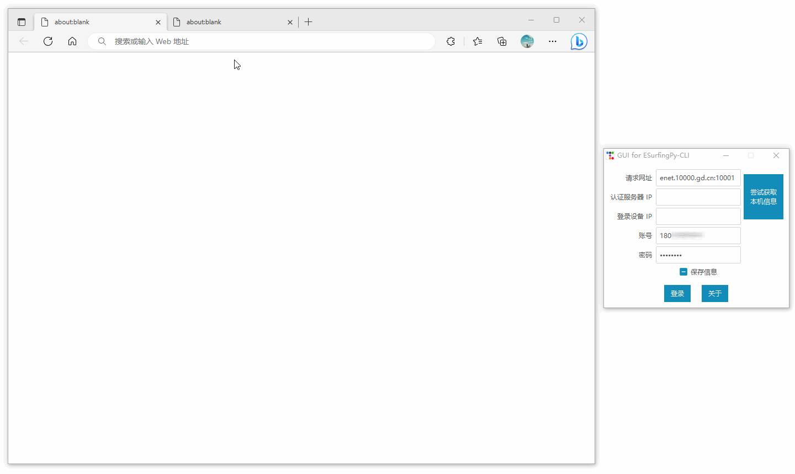

# ESurfingPy-CLI

## 简介

基于 Python 实现登录和登出广东天翼校园网网页认证的命令行工具。可以用该工具来快速登录或登出广东天翼校园网，或者反复重新登录来重置限速状态，以 “破解” 限速。


<br />

## 项目演示

### 图形界面



### 命令行


<br />

## 适用学校

> 小道消息，广东天翼校园网于2021年10月20日，凌晨期间“优化”了校园网，实则是关闭了部分学校的网页认证通道。一些学校原本只是前端网页删除或屏蔽了登录相关组件的学校，其实还是可以使用类似此项目相关的基于网页认证的程序实现网页登录，但关闭认证通道后就彻底用不了（提示 `已办理一人一号多终端业务的用户，请使用客户端登录` 或 `当前该账号的拨号方式错误` ）。此项目不再适用于这些学校，目前只适用于没有关闭网页认证通道的广东天翼校园网。

如果你的学校校园网是广东天翼校园网，欢迎使用并反馈项目适用情况：[discussion#3](https://github.com/Pandaft/ESurfingPy-CLI/discussions/3)

<br />

## 下载运行

### 运行已编译的可执行文件

程序打包了识别验证码所需的模型文件，因此文件体积较大。

由 GitHub Actions 自动编译并发布，下载链接：[Releases(发行版)](https://github.com/Pandaft/ESurfingPy-CLI/releases)

### 运行源码

Python <= 3.10，Linux 可能需要将 `pip` 换为 `pip3`， `python` 换为 `python3`。

```shell
git clone https://github.com/Pandaft/ESurfingPy-CLI.git
cd ESurfingPy-CLI
pip install -r requirements.txt
python main.py
```

<br />

## 参数说明

设备刚连上校园网络时自动弹出的，或者已经连上但未登录时打开任意网页跳转到下面这个登录网页，其中有此程序要的参数：


1. `ESurfingURL` ：校园网登录网址（部分），需要带端口。未登录时可能会出现域名解析错误（未能连接DNS服务器），可以先手动登录校园网后，使用 ping 等网络工具解析，然后用 `IP:端口` 代替，例如：`125.88.59.131:10001`
2. `WlanACIP` ：校园网的认证服务器IP，应该每个学校都不同；
3. `WlanUserIP` ：要登录的设备的IP，**可以不是本机的，实现远程登录**；
4. `Account` ：校园网账号
5. `Password` ：校园网账号的密码

<br />

## 命令行

```shell
> ./ESurfingPy-CLI.exe --help
Usage: ESurfingPy-CLI.exe [OPTIONS] COMMAND [ARGS]...

  基于 Python 实现登录和登出广东天翼校园网网页认证通道的命令行工具。

Options:
  --help  Show this message and exit.

Commands:
  auto     多种模式触发重登校园网
  gui      启动图形界面
  login    登录校园网
  logout   登出校园网
  ocr      识别图片
  version  输出当前版本
```

### 启动图形界面

```shell
> ./ESurfingPy-CLI.exe gui --help
Usage: ESurfingPy-CLI.exe gui [OPTIONS]

  启动图形界面

Options:
  --help  Show this message and exit.
```

不带命令和参数直接运行则默认启动图形界面，也可通过加 `gui` 命令来启动。

### 登录

```shell
> ./ESurfingPy-CLI.exe login --help
Usage: ESurfingPy-CLI.exe login [OPTIONS]

  登录校园网

Options:
  -u, --esurfing-url TEXT  校园网登录网址  [default: enet.10000.gd.cn:10001]
  -c, --wlan-acip TEXT     认证服务器IP
  -r, --wlan-userip TEXT   登录设备IP
  -a, --account TEXT       账号
  -p, --password TEXT      密码
  -v, --verbose BOOLEAN    输出详细过程  [default: True]
  --help                   Show this message and exit.
```

**本机登录校园网的话，`-u`, `-c`, `-r` 可以不填，程序会尝试自动获取。**

示例：`./ESurfingPy-CLI.exe login -u 125.88.59.131:10001 -c 123.123.123.123 -r 234.234.234.234 -a 15012341234 -p 12345678 -v true`

### 登出

```shell
> ./ESurfingPy-CLI.exe logout --help
Usage: ESurfingPy-CLI.exe logout [OPTIONS]

  登出校园网

Options:
  -u, --esurfing-url TEXT  校园网登录网址
  -c, --wlan-acip TEXT     认证服务器IP
  -r, --wlan-userip TEXT   登录设备IP
  -a, --account TEXT       账号
  -p, --password TEXT      密码
  -s, --signature TEXT     签名
  -v, --verbose BOOLEAN    输出详细过程  [default: True]
  --help                   Show this message and exit.
```

- 如果填写了 `signature` ，不需要填写 `password` ；
- 如果没有填写 `signature` ，需要填写账号和密码，程序会尝试登录来获取 `signature` 然后再登出。

`signature` 可以登录获得（即使重复登录），可以自己写程序将登录时返回的 `signature` 保存下来，需要时再读取使用。

示例：`./ESurfingPy-CLI.exe logout -u 125.88.59.131:10001 -c 123.123.123.123 -r 234.234.234.234 -a 15012341234 -s XXXXXXXXXXXXXXXXXXXXXXXXXXXXXXXX -v true`

### 识别验证码

```shell
> ESurfingPy-CLI.exe ocr --help
Usage: ESurfingPy-CLI.exe ocr [OPTIONS]

  识别图片

Options:
  -i, --image TEXT  图片路径
  --help            Show this message and exit.
```

示例：`./ESurfingPy-CLI.exe ocr -i code.png`

### 多种模式自动重登

```shell
> ./ESurfingPy-CLI.exe auto --help
Usage: ESurfingPy-CLI.exe auto [OPTIONS]

  多种模式触发重登校园网

Options:
  -m, --mode [uls|dls|ult|dlt|itv|mul]
                                  触发模式
  -t, --threshold FLOAT           触发网速(MB/s)或流量(MB)或时间(s)
  -s, --auto-stop BOOLEAN         自动停止(仅对网速模式有效)  [default: True]
  -u, --esurfing-url TEXT         校园网登录网址  [default: enet.10000.gd.cn:10001]
  -c, --wlan-acip TEXT            认证服务器IP
  -r, --wlan-userip TEXT          登录设备IP
  -a, --account TEXT              账号
  -p, --password TEXT             密码
  -v, --verbose BOOLEAN           输出详细过程  [default: True]
  --help                          Show this message and exit.
```

触发模式：

| 值   | 说明                                       |
|-----|------------------------------------------|
| uls | 实时监控**上传**速率（MB/s），连续 10s 低于指定值时自动重登校园网。 |
| dls | 实时监控**下载**速率（MB/s），连续 10s 低于指定值时自动重登校园网。 |
| ult | 实时监控**上传**流量（MB），达到指定值时自动重登校园网。          |
| dlt | 实时监控**下载**流量（MB），达到指定值时自动重登校园网。          |
| itv | 每间隔指定的时间（s）自动重登校园网。                      |
| mul | 手动回车后重登校园网。                              |

示例：

- 实时监控上传速率，连续 10s 低于 3MB/s 时自动重登：

`./ESurfingPy-CLI.exe auto -m uls -t 3 -u 125.88.59.131:10001 -c 123.123.123.123 -r 234.234.234.234 -a 15012341234 -p 12345678 -v true`

- 实时监控下载流量，达到 600MB 时自动重登： 

`./ESurfingPy-CLI.exe auto -m dlt -t 600 -u 125.88.59.131:10001 -c 123.123.123.123 -r 234.234.234.234 -a 15012341234 -p 12345678 -v true`

<br />

## 应用示例

### 1. Win10 快速一键登录/登出

利用快捷方式，可以实现带参数启用程序：


记得不要移动原文件，否则快捷方式会不可用。

### 2. Win10 开机自动登录校园网

根据上述制作一个登录的快捷方式，然后按下 `Win` + `R` 输入 `shell:startup` 并确定，将登录的快捷方式拖进弹出的窗口，如果杀毒软件提示有程序想自启就点允许就可以了。

### 3. 更多

可以自己开发脚本或程序，设定特定条件后调用此程序，来实现更多的功能等等……

<br />

## 免责声明

此项目仅供研究、学习和交流，请勿用于商业或非法用途，开发者与协作者不对使用者负任何法律责任，使用者自行承担因不当使用所产生的后果与责任。

This project is only for research, learning and exchange. Do not use it for commercial or illegal purposes. Developers and collaborators do not assume any legal responsibility for users. Users bear the consequences and responsibilities arising from improper use.

<br />

## 其他

如果此项目对你有帮助，求点个 ★ ！

项目QQ群讨论群：791455104
