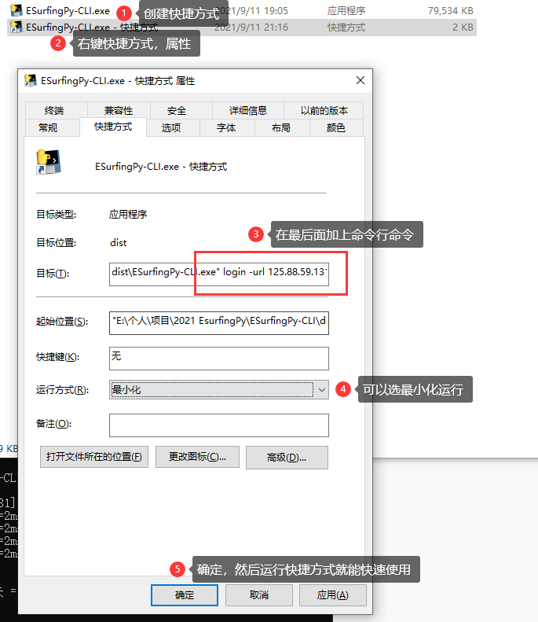

# ESurfingPy-CLI

------

## 简介

基于 Python 实现登录和登出广东天翼校园网的命令行工具。根据网页认证的源码和抓包分析研究而成，如果你的学校用此方式登录会提示 `已办理一人一号多终端业务的用户，请使用客户端登录`，那么用此程序也是一样的结果的。


我所在的学校的广东天翼校园网在短时间内上传 500MB 或下载 600 MB 后就会严重限速至 512KB/s 或 2.5MB/s，只能过一段时间才会恢复，但是可以通过重新登录实现重置限速状态，这是我开发这个项目的原因。


## 依赖

如果要运行此项目的 .py 文件，需要安装部分第三方模块和 Tesseract 程序。

如果要运行已经打包好的 .exe 文件，只需要安装 Tesseract 程序即可。

### 第三方模块

此项目用到了 `psutil` 、 `pytesseract` 、`execjs` 等模块。

可以执行 `pip install psutil` 命令安装，网络不畅通可以用豆瓣镜像源代替：

`pip install psutil -i http://pypi.douban.com/simple --trusted-host pypi.douban.com`

其他的模块替换上述命令中的 `psutil` 即可。

### Tesseract - 离线识别验证码

广东天翼校园网网页登录方式需要验证码，此项目调用 Tesseract 实现离线识别验证码。

[【官方】tesseract-ocr-w64-setup-v5.0.0.20190623.exe](https://digi.bib.uni-mannheim.de/tesseract/tesseract-ocr-w64-setup-v5.0.0.20190623.exe)

[【分流】tesseract-ocr-w64-setup-v5.0.0.20190623.exe](https://wwa.lanzoui.com/iG1WHqhz7ni)

下载并安装即可。


## 参数说明

设备刚连上校园网络时自动弹出的，或者已经连上但未登录时打开任意网页跳转到下面这个登录网页，其中有此程序要的参数：


1. `ESurfingURL` ：校园网登录网址（部分），需要带端口。未登录时可能会出现域名解析错误（未能连接DNS服务器），可以先手动登录校园网后，使用 ping 等网络工具解析，然后用 `IP:端口` 代替，例如：`125.88.59.131:10001`
2. `WlanACIP` ：校园网的认证服务器IP，应该每个学校都不同；
3. `WlanUserIP` ：要登录的设备的IP，可以不是本机的，实现远程登录；
4. `Account` ：校园网账号
5. `Password` ：校园网账号的密码

------

# 命令行（CLI）

可以通过调用 main.py 或已经编译好的可执行文件（没有适合自己架构的可以自行编译）来快速使用。

```
./ESurfingPy-CLI.exe --help
Usage: ESurfingPy-CLI.exe [OPTIONS] COMMAND [ARGS]...

Options:
  --help  Show this message and exit.

Commands:
  auto    多种模式触发重登校园网
  login   发送 GET 请求登录校园网
  logout  发送 POST 请求登出校园网
  ocr     识别验证码（可作调试用）
```

### 登录

``` 
./ESurfingPy-CLI.exe login --help
Usage: ESurfingPy-CLI.exe login [OPTIONS]

  发送 GET 请求登录校园网

Options:
  -url, --esrfingurl TEXT     登录网址
  -acip, --wlanacip TEXT      认证服务器IP
  -userip, --wlanuserip TEXT  登录设备IP
  -acc, --account TEXT        账号
  -pwd, --password TEXT       密码
  -details BOOLEAN            输出详细过程
  -debug BOOLEAN              调试模式
  --help                      Show this message and exit.
```

示例：`./ESurfingPy-CLI.exe login -url 125.88.59.131:10001 -acip 123.123.123.123 -userip 234.234.234.234 -acc 15012341234 -pwd 12345678 -details true`

### 登出

```
./ESurfingPy-CLI.exe logout --help
Usage: ESurfingPy-CLI.exe logout [OPTIONS]

  发送 POST 请求登出校园网

Options:
  -url, --esrfingurl TEXT     登出网址
  -acip, --wlanacip TEXT      认证服务器IP
  -userip, --wlanuserip TEXT  登录设备IP
  -acc, --account TEXT        账号
  -sign, --signature TEXT     登录成功时返回的签名
  -details BOOLEAN            输出详细过程
  -debug BOOLEAN              调试模式
  --help                      Show this message and exit.
```

示例：`./ESurfingPy-CLI.exe logout -url 125.88.59.131:10001 -acip 123.123.123.123 -userip 234.234.234.234 -acc 15012341234 -sign XXXXXXXXXXXXXXXXXXXXXXXXXXXXXXXX -details true`

`signature` 可以登录获得（即使重复登录），也可以自己写程序将登录时返回的 `signature` 保存下来，需要时再读取使用。

### 识别验证码

``` ESurfingPy-CLI.exe ocr --help
Usage: ESurfingPy-CLI.exe ocr [OPTIONS]

  识别验证码（可作调试用）

Options:
  -img, --imagefile TEXT  图片路径
  --help                  Show this message and exit.
```

示例：

识别当前目录下的 code.png ：`./ESurfingPy-CLI.exe ocr code.png`

### 多种模式自动重登

```
./ESurfingPy-CLI.exe auto --help
Usage: ESurfingPy-CLI.exe auto [OPTIONS]

  多种模式触发重登校园网

Options:
  -m, --mode TEXT             触发模式
  -v, --value TEXT            触发网速(MB/s)或流量(MB)或时间(s)
  -as, --autostop BOOLEAN     自动停止(连续 10s 低于 0.1MB/s，仅对 1、2 模式有效)
  -url, --esrfingurl TEXT     登出网址
  -acip, --wlanacip TEXT      认证服务器IP
  -userip, --wlanuserip TEXT  登录设备IP
  -acc, --account TEXT        账号
  -pwd, --password TEXT       密码
  -details BOOLEAN            输出详细过程
  -debug BOOLEAN              调试模式
  --help                      Show this message and exit.
```

触发模式：

| 值   | 说明                                                         |
| ---- | ------------------------------------------------------------ |
| 1    | 实时监控**上传**速率（MB/s），连续 10s 低于指定值时自动重登校园网。 |
| 2    | 实时监控**下载**速率（MB/s），连续 10s 低于指定值时自动重登校园网。 |
| 3    | 实时监控**上传**流量（MB），达到指定值时自动重登校园网。     |
| 4    | 实时监控**下载**流量（MB），达到指定值时自动重登校园网。     |
| 5    | 每间隔指定的时间（s）自动重登校园网。                        |
| 6    | 手动回车后重登校园网。                                       |

示例：

+ 实时监控上传速率，连续 10s 低于 3MB/s 时自动重登：

`./ESurfingPy-CLI.exe auto -m 1 -v 3 -as true -url 125.88.59.131:10001 -acip 123.123.123.123 -userip 234.234.234.234 -acc 15012341234 -pwd 12345678 -details true`

+ 实时监控下载流量，达到 600MB 时自动重登：（-as 在此无效，随意输入就行）

`./ESurfingPy-CLI.exe auto -m 4 -v 600 -as true -url 125.88.59.131:10001 -acip 123.123.123.123 -userip 234.234.234.234 -acc 15012341234 -pwd 12345678 -details true`


------

## 应用

### 1. Win10 快速一键登录/登出

利用快捷方式，可以实现带参数启用程序：



记得不要移动原文件，否则快捷方式会不可用。

### 2. Win10 开机自动登录校园网

根据上一个制作一个登录的快捷方式，然后按下 `Win` + `R` 输入 `shell:startup` ，将登录的快捷方式拖进去，如果杀毒软件提示有程序想自启就点允许就可以了。

### 3. 更多

你可以自己开发程序，设定特定条件后调用此程序，来实现更多的功能等等……


------

# 不足

1. 如果有网络的话识别验证码只需调用网络 API 即可，但此项目性质特殊，本身就是用于登录校园网以连接互联网。在断网识别验证码的方法中，我选择了调用 Tesseract 来实现离线识别验证码，效率实测高效，准确率也不错，但缺点是在新环境中使用此程序时需要安装 Tesseract。欢迎 PR 不依赖第三方程序的验证码识别方法！
2. 登录校园网过程中需要将 账号、密码和验证码 三者拼接后经 RSA 加密计算得到 loginkey 发送到服务器请求登录，但我不懂 RSA 加密算法，因此项目通过将校园网的实现 RSA 加密的原 js 文件魔改后，使用 `execjs` 模块在 Python 中传入参数来获得 loginkey，缺点是效率会低很多。欢迎 PR 更好的计算方法！

如果对以上两点有改进想法和能力的欢迎参与开发此项目。

项目QQ群讨论群号码：791455104